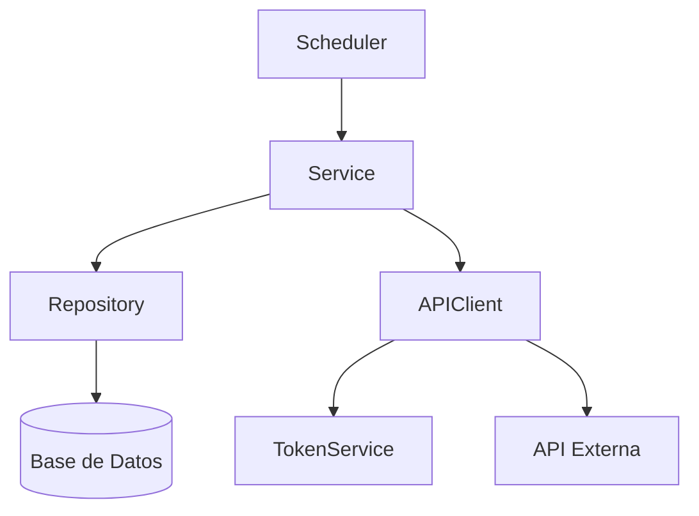
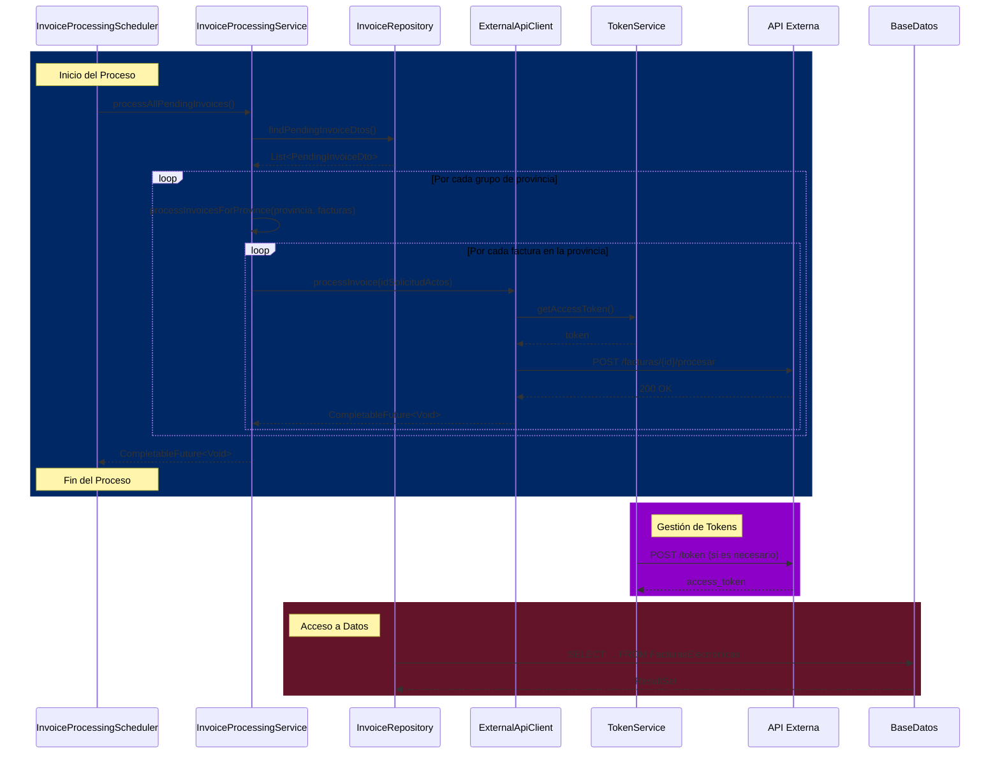

# 🚀 Sistema de Procesamiento de Facturas

## 📋 Tabla de Contenidos
- [Descripción](#-descripción)
- [Arquitectura](#-arquitectura)
- [Requisitos](#-requisitos)
- [Configuración](#-configuración)
- [Uso](#-uso)
- [Flujo de Procesamiento](#-flujo-de-procesamiento)
- [Componentes Principales](#-componentes-principales)
- [Manejo de Errores](#-manejo-de-errores)
- [Rendimiento](#-rendimiento)
- [Contribución](#-contribución)
- [Licencia](#-licencia)

## 📝 Descripción

Sistema de procesamiento de facturas diseñado para manejar grandes volúmenes de facturas de manera eficiente. El sistema:

- Procesa facturas en paralelo agrupadas por provincia
- Utiliza programación reactiva para un manejo eficiente de recursos
- Implementa autenticación OAuth2 segura
- Incluye manejo robusto de errores y reintentos

## 🏗️ Arquitectura



## 🛠️ Requisitos

- Java 17+
- Maven 3.8+
- Base de datos SQL Server
- Acceso a API externa de facturación
- Spring Boot 3.0+

## ⚙️ Configuración

1. Clonar el repositorio:
   ```bash
   git clone https://github.com/tu-usuario/demo.git
   cd demo
   ```

2. Configurar las variables de entorno en `application.yml`:
   ```yaml
   app:
     security:
       oauth2:
         token:
           url: ${TOKEN_URL}
           client-id: ${CLIENT_ID}
           username: ${API_USERNAME}
           password: ${API_PASSWORD}
   ```

3. Configurar la conexión a la base de datos en `application.properties`:
   ```properties
   spring.datasource.url=jdbc:sqlserver://localhost:1433;databaseName=TuBaseDeDatos
   spring.datasource.username=usuario
   spring.datasource.password=contraseña
   ```

## 🚀 Uso

1. Iniciar la aplicación:
   ```bash
   mvn spring-boot:run
   ```

2. El sistema comenzará a procesar facturas automáticamente cada 5 segundos.


## 🔄 Flujo de Procesamiento

1. **Programación**: El `InvoiceProcessingScheduler` inicia el proceso cada 5 segundos.
2. **Obtención de Datos**: Se consultan las facturas pendientes de la base de datos.
3. **Agrupación**: Las facturas se agrupan por provincia para procesamiento paralelo.
4. **Procesamiento**: Cada grupo de facturas se procesa en paralelo.
5. **Comunicación con API**: Cada factura se envía a la API externa para su procesamiento.
6. **Actualización**: Se registra el resultado del procesamiento.

## 📊 Diagrama de Secuencia Detallado

El siguiente diagrama muestra el flujo detallado de interacciones entre los componentes del sistema:



### Explicación del Diagrama

1. **Proceso Principal (Azul Oscuro)**:
   - El `Scheduler` inicia el proceso llamando a `processAllPendingInvoices()` en el `Service`
   - El `Service` consulta las facturas pendientes al `Repository`
   - Para cada provincia, se procesan las facturas en paralelo
   - Cada factura se envía al `APIClient` para su procesamiento
   - El `APIClient` obtiene un token de autenticación del `TokenService`
   - Se realiza la llamada a la API externa

2. **Gestión de Tokens (Púrpura)**:
   - El `TokenService` se encarga de obtener y renovar tokens de acceso
   - Los tokens se almacenan en caché hasta su expiración

3. **Acceso a Datos (Rojo Oscuro)**:
   - El `Repository` consulta las facturas pendientes en la base de datos
   - Los resultados se mapean a objetos DTO para su procesamiento

### Flujo de Ejecución

1. **Inicio del Proceso**:
   - El `Scheduler` inicia el proceso cada 5 segundos
   - Se verifica que no haya otra ejecución en curso

2. **Obtención de Facturas**:
   - Se consultan las facturas pendientes agrupadas por provincia
   - Cada grupo se procesa en un hilo separado

3. **Procesamiento Paralelo**:
   - Cada provincia procesa sus facturas de forma independiente
   - Las facturas dentro de cada provincia también se procesan en paralelo

4. **Comunicación con API Externa**:
   - Para cada factura, se obtiene un token de acceso
   - Se envía la factura a la API externa
   - Se manejan los errores de forma individual

5. **Finalización**:
   - Se espera a que todas las provincias terminen su procesamiento
   - Se registran las estadísticas de ejecución

## 🧩 Componentes Principales

### 1. InvoiceProcessingScheduler
- Programa la ejecución periódica del proceso
- Evita ejecuciones concurrentes
- Manejo inicial de errores

### 2. InvoiceProcessingService
- Coordina el flujo completo de procesamiento
- Gestiona el paralelismo por provincia
- Maneja la lógica de negocio

### 3. ExternalApiClient
- Gestiona la comunicación con la API externa
- Maneja la autenticación y renovación de tokens
- Implementa reintentos y manejo de errores

### 4. TokenService
- Gestiona la autenticación OAuth2
- Renovación automática de tokens
- Caché de tokens para mejor rendimiento

## ⚠️ Manejo de Errores

El sistema implementa un manejo de errores en múltiples niveles:

1. **Nivel de Factura Individual**:
   - Reintentos automáticos para errores transitorios
   - Registro detallado de errores
   - Aislamiento de fallos

2. **Nivel de Provincia**:
   - Continuación del procesamiento si una factura falla
   - Agregación de errores

3. **Nivel Global**:
   - Monitoreo de estado de salud
   - Alertas para errores críticos

## ⚡ Rendimiento

- **Procesamiento Paralelo**: Uso de `CompletableFuture` para procesamiento asíncrono
- **Gestión de Recursos**: Control de concurrencia y manejo eficiente de conexiones
- **Monitoreo**: Métricas detalladas y logs para análisis de rendimiento

