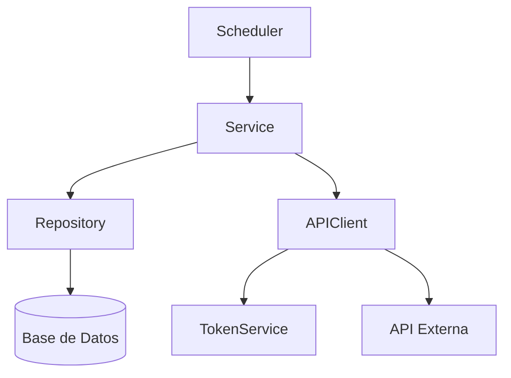

# 🚀 Sistema de Procesamiento de Facturas

## 📋 Tabla de Contenidos
- [Descripción](#-descripción)
- [Arquitectura](#-arquitectura)
- [Requisitos](#-requisitos)
- [Configuración](#-configuración)
- [Uso](#-uso)
- [Flujo de Procesamiento](#-flujo-de-procesamiento)
- [Componentes Principales](#-componentes-principales)
- [Manejo de Errores](#-manejo-de-errores)
- [Rendimiento](#-rendimiento)
- [Contribución](#-contribución)
- [Licencia](#-licencia)

## 📝 Descripción

Sistema de procesamiento de facturas diseñado para manejar grandes volúmenes de facturas de manera eficiente. El sistema:

- Procesa facturas en paralelo agrupadas por provincia
- Utiliza programación reactiva para un manejo eficiente de recursos
- Implementa autenticación OAuth2 segura
- Incluye manejo robusto de errores y reintentos

## 🏗️ Arquitectura



## 🛠️ Requisitos

- Java 17+
- Maven 3.8+
- Base de datos SQL Server
- Acceso a API externa de facturación
- Spring Boot 3.0+

## ⚙️ Configuración

1. Clonar el repositorio:
   ```bash
   git clone https://github.com/tu-usuario/demo.git
   cd demo
   ```

2. Configurar las variables de entorno en `application.yml`:
   ```yaml
   app:
     security:
       oauth2:
         token:
           url: ${TOKEN_URL}
           client-id: ${CLIENT_ID}
           username: ${API_USERNAME}
           password: ${API_PASSWORD}
   ```

3. Configurar la conexión a la base de datos en `application.properties`:
   ```properties
   spring.datasource.url=jdbc:sqlserver://localhost:1433;databaseName=TuBaseDeDatos
   spring.datasource.username=usuario
   spring.datasource.password=contraseña
   ```

## 🚀 Uso

1. Iniciar la aplicación:
   ```bash
   mvn spring-boot:run
   ```

2. El sistema comenzará a procesar facturas automáticamente cada 5 segundos.

3. Ver los logs para monitorear el progreso:
   ```
   tail -f logs/application.log
   ```

## 🔄 Flujo de Procesamiento

1. **Programación**: El `InvoiceProcessingScheduler` inicia el proceso cada 5 segundos.
2. **Obtención de Datos**: Se consultan las facturas pendientes de la base de datos.
3. **Agrupación**: Las facturas se agrupan por provincia para procesamiento paralelo.
4. **Procesamiento**: Cada grupo de facturas se procesa en paralelo.
5. **Comunicación con API**: Cada factura se envía a la API externa para su procesamiento.
6. **Actualización**: Se registra el resultado del procesamiento.

## 🧩 Componentes Principales

### 1. InvoiceProcessingScheduler
- Programa la ejecución periódica del proceso
- Evita ejecuciones concurrentes
- Manejo inicial de errores

### 2. InvoiceProcessingService
- Coordina el flujo completo de procesamiento
- Gestiona el paralelismo por provincia
- Maneja la lógica de negocio

### 3. ExternalApiClient
- Gestiona la comunicación con la API externa
- Maneja la autenticación y renovación de tokens
- Implementa reintentos y manejo de errores

### 4. TokenService
- Gestiona la autenticación OAuth2
- Renovación automática de tokens
- Caché de tokens para mejor rendimiento

## ⚠️ Manejo de Errores

El sistema implementa un manejo de errores en múltiples niveles:

1. **Nivel de Factura Individual**:
   - Reintentos automáticos para errores transitorios
   - Registro detallado de errores
   - Aislamiento de fallos

2. **Nivel de Provincia**:
   - Continuación del procesamiento si una factura falla
   - Agregación de errores

3. **Nivel Global**:
   - Monitoreo de estado de salud
   - Alertas para errores críticos

## ⚡ Rendimiento

- **Procesamiento Paralelo**: Uso de `CompletableFuture` para procesamiento asíncrono
- **Gestión de Recursos**: Control de concurrencia y manejo eficiente de conexiones
- **Monitoreo**: Métricas detalladas y logs para análisis de rendimiento

## 🤝 Contribución

1. Hacer fork del repositorio
2. Crear una rama para la nueva característica (`git checkout -b feature/nueva-caracteristica`)
3. Hacer commit de los cambios (`git commit -am 'Añadir nueva característica'`)
4. Hacer push a la rama (`git push origin feature/nueva-caracteristica`)
5. Crear un nuevo Pull Request

## 📄 Licencia

Este proyecto está bajo la Licencia MIT - ver el archivo [LICENSE](LICENSE) para más detalles.