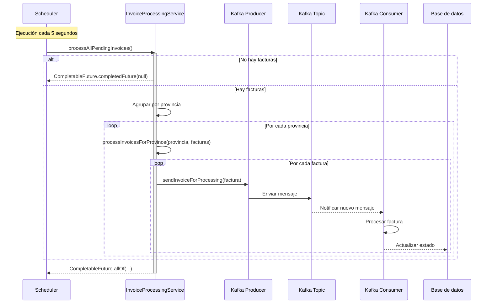

```mermaid
sequenceDiagram
    participant Scheduler as Scheduler
    participant Service as InvoiceProcessingService
    participant Producer as Kafka Producer
    participant Kafka as Kafka Topic
    participant Consumer as Kafka Consumer
    
    Note over Scheduler: Ejecución cada 5 segundos
    Scheduler->>Service: processAllPendingInvoices()
    activate Service
    
    alt No hay facturas
        Service-->>Scheduler: CompletableFuture.completedFuture(null)
    else Hay facturas
        Service->>Service: Agrupar por provincia
        loop Por cada provincia
            Service->>Service: processInvoicesForProvince(provincia, facturas)
            loop Por cada factura
                Service->>Producer: sendInvoiceForProcessing(factura)
                Producer->>Kafka: Enviar mensaje
                Kafka-->>Consumer: Notificar nuevo mensaje
                Consumer->>Consumer: Procesar factura
                Consumer-->>Base de datos: Actualizar estado
            end
        end
    end
    
    Service-->>Scheduler: CompletableFuture.allOf(...)
    deactivate Service
```
